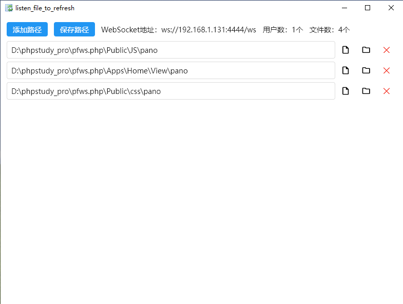

# listen_file_to_refresh 监听文件并刷新

[以后更新在这里](https://gitee.com/null_593_9900/listen_file_to_refresh)
## 软件缘由: 为了编写原生js或者jQuery页面不会自动刷新.



### 添加文件路径实现监听

- WebSocket地址: 在软件页面上, 点击自动复制
- 选择监听路径尽可能范围小
- 选择监听文件数限制3000
- 只监听 'html', 'css', 'js'文件
- Windows 安全警报 要选择 公用网络, 手机设备才能连上ws

### 使用方法(在js文件添加以下代码片段, 并替换WebSocket地址)

```js

try {
  // var opt = new Viewer();
  代码区
} finally {
  (function () {
    var lockReconnect = false;

    // 自动重连
    function reconnect() {
      if (lockReconnect) return;
      lockReconnect = true;
      setTimeout(function () {
        lockReconnect = false;
        ws();
      }, 3000);
    }

    function ws() {
      // Replace websocket address
      var ws = new WebSocket('替换WebSocket地址');
      // ws.onopen = function (evt) {};
      ws.onmessage = function (evt) {
        console.log(evt.data);
        if (evt.data === '1') location.reload(true)
      };
      ws.onclose = reconnect;
      ws.onerror = reconnect
    }

    if (['localhost', '192.168.1.131'].indexOf(window.location.hostname) > -1) {
      ws();
    }

  })()
}

```
